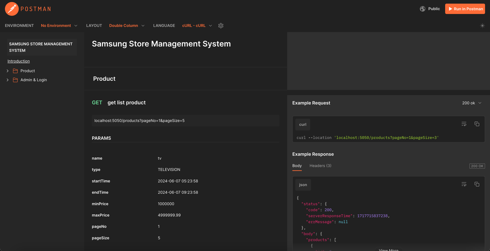
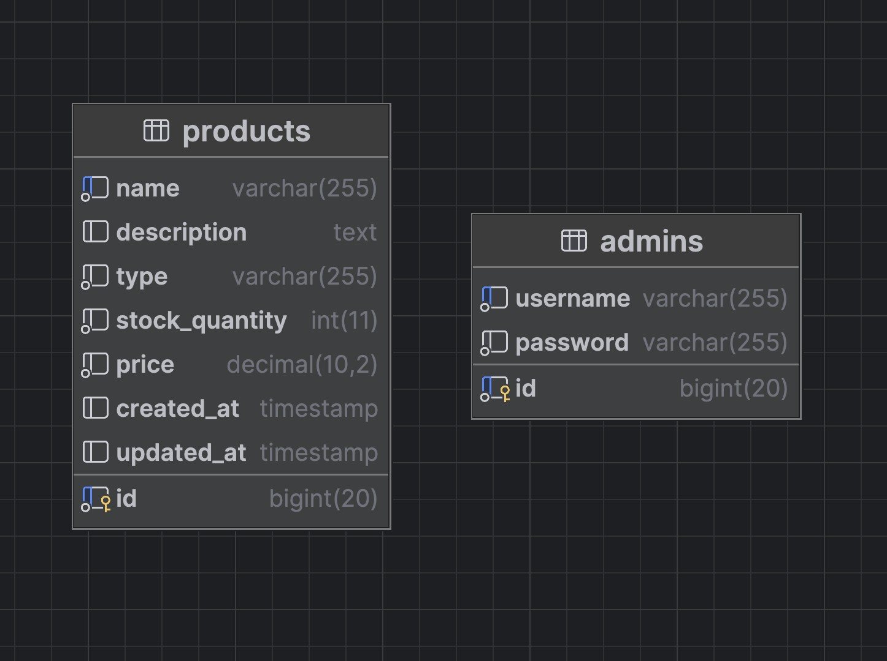

<!-- PROJECT LOGO -->
<br />
<p align="center">
  <h3 align="center">Samsung Store Management System</h3>

  <p align="center">
   An App to Authenticate Admin and CRUD for Samsung Store Products
    <br />
    <br />
  </p>


### API Documentation (Postman Documenter)
<h3>[Click here for documentation link](https://documenter.getpostman.com/view/15423225/2sA3XJkQeD)</h3>




### DB Architecture


### Built With

-   [Ratpack](https://ratpack.io/)
-   [Java 8](https://www.java.com/en/)
-   [Maven](https://maven.apache.org/)
-   [MySql](https://www.mysql.com/)
-   [Hibernate](https://hibernate.org/)
-   [Liquibase](https://www.liquibase.com/)
-   [Docker](https://www.docker.com/)

<br/>

<!-- GETTING STARTED -->

## Getting Started

To start on your local machine, we provide 2 ways :
1. maven
2. docker-compose

### The Maven Way
Prerequisite : make sure that your local computer java & maven installed and mysql is running
1. Clone the repo
    ```sh
    git clone https://github.com/advistasyam/samsung-store-management-system
    ```
2. Create Schema 
    ```sh
    mysql -u root -e "CREATE DATABASE IF NOT EXISTS samsung_store_management_system;"
    ```
3. Install dependencies
   ```sh
    mvn clean install
    ```
4. Run liquibase update to migrate table to DB
   ```sh
    mvn liquibase:update
    ```
5. Run Main.java
   ```sh
    mvn exec:java -Dexec.mainClass="com.samsung.Main"
    ```
### The Docker Way
Prerequisite : Make sure that you have install docker-compose & docker, and your 5050 and 3306 port is not used

1. Clone the repo
    ```sh
    git clone https://github.com/advistasyam/samsung-store-management-system
    ```
2. Run Docker Container
    ```sh
    docker-compose up -d
    ```

## Architecture Explanation
### Ratpack
Ratpack is somewhat different from Spring. Ratpack is a lightweight HTTP library built for Java that uses context for every HTTP call. For every module created, we will create 4 foundational components:

1. Routes.java

The Routes file contains URLs and methods and maps the URLs to a designated handler.

2. Handler.java

The Handler is similar to a controller in Spring, but in Ratpack, it's called a handler. The handler is the first layer of logic to parse the request and call various services to generate a response.

3. Service.java

The Service is a collection of functions that parse parameters into results. A service may contain other services and repository classes.

4. Repository.java

The Repository file connects with the database. For best practices, it should not be called directly by the handler. Each table in the database should have only one corresponding repository file.

### Database (MySQL)
All data will be stored in a MySQL database. To facilitate the connection between our Ratpack application and MySQL, we use two libraries: Hibernate and Liquibase.

#### Liquibase
Liquibase will serve as a version control system for the database schema. Any changes to the table structure will be managed through this system. You can refer to the changelog file here:

> src/main/resources/db/changelog/db.changelog-master.xml

To apply new updates from the changelog or when setting up the repository for the first time, run the following command:

> mvn liquibase:update

#### Hibernate
Hibernate is an ORM (Object-Relational Mapping) system that connects our database to executable Java code. For Hibernate, we will primarily create Entity Java classes for each table. These entities will be used by Hibernate to perform Insert, Update, and Delete operations on the database, as well as to read data from the database.

   
## Contributing!

Contributions are what make the open source community such an amazing place to be learn, inspire, and create. Any contributions you make are **greatly appreciated**.

1. Fork the Project
2. Create your Feature Branch with your name (`git checkout -b yourname/AmazingFeature`)
3. Commit your Changes (`git commit -m 'Add some AmazingFeature'`)
4. Push to the Branch (`git push origin yourname/AmazingFeature`)
5. Open a Pull Request